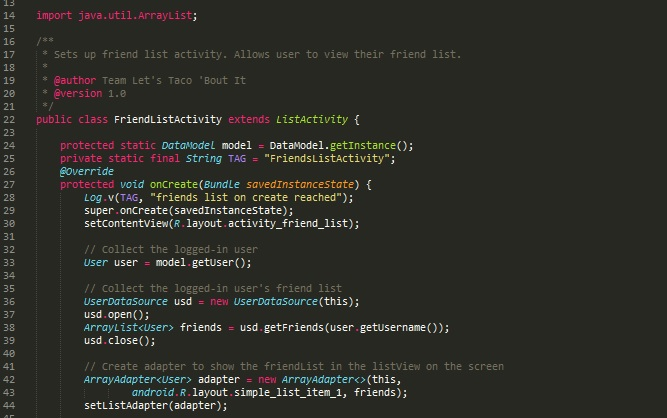
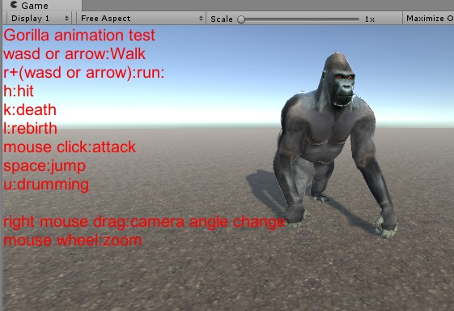

## Shopping With Friends App

Five group members created a social app called "Shopping With Friends"

The app included user profiles and gps location

The following screenshot is from the file 'FriendListActivity.java'

This file allowed users to view their list of friends

## Harambe Zoo Escape Video Game

Five group members are currently creating a video game

The user plays as a gorilla trying to escape the zoo

The game involves creating an animator controller, character AI, physics interactions, etc.

The following is a screenshot of player character in demo mode

